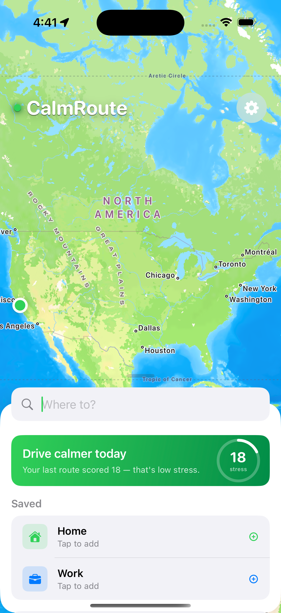
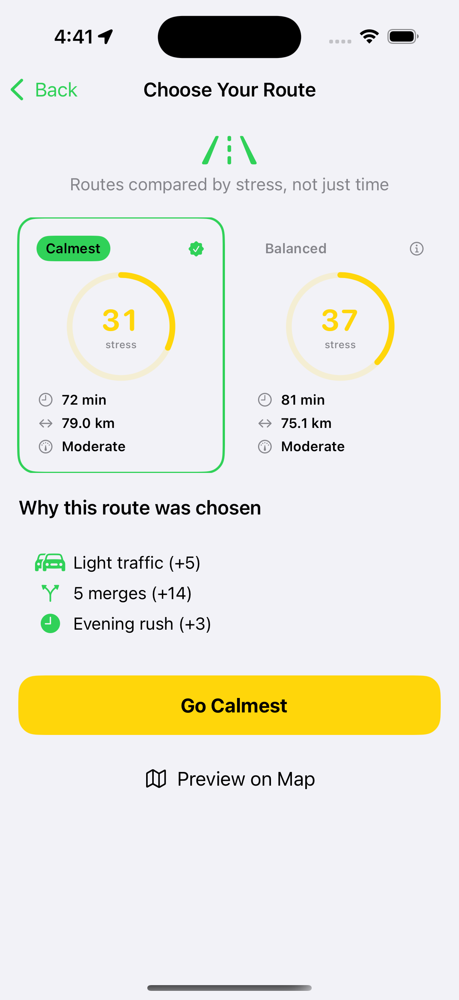
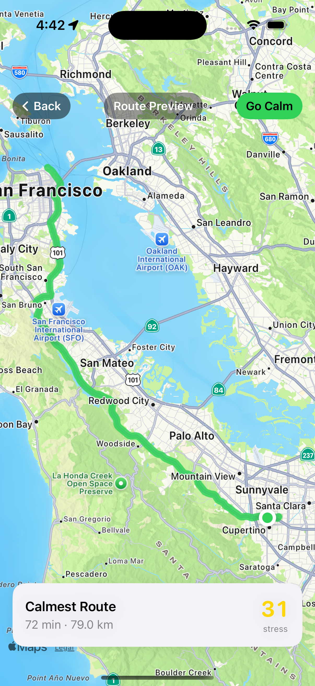
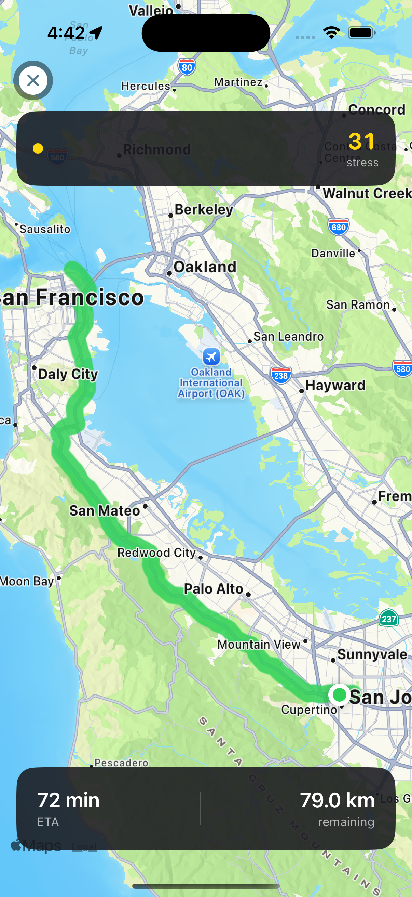

# CalmRoute

**Stress-aware navigation for iOS.** CalmRoute finds the least stressful route to your destination — not just the fastest one.

Most navigation apps optimize for time. CalmRoute optimizes for how you feel when you arrive.

---

## Screenshots

<!-- Replace with actual simulator screenshots after running the app -->
| Search | Route Comparison | Map Preview | Navigation |
|--------|-----------------|-------------|------------|
|  |  |  |  |

---

## How the stress score works

Every route is scored 0–100 using a weighted formula across five factors:

| Factor | Weight | Source |
|--------|--------|--------|
| Traffic density | 30% | `MKRoute.expectedTravelTime` vs free-flow proxy |
| Junction count | 25% | `MKRoute.steps` — merges, U-turns, complex intersections |
| Road type penalty | 20% | Step instruction analysis — school zones, construction |
| Weather impact | 15% | WeatherKit — rain +15, snow +25, fog +20 |
| Time of day | 10% | Rush hour multiplier ×1.4 (7–9am, 5–7pm) |

The score is transparent — users see exactly why a route scored the way it did: *"3 complex merges, school zone at pickup time, light rain (+8 pts)"*

---

## Architecture

```
CalmRoute/
├── App/                    @main entry, WindowGroup
├── Models/                 ScoredRoute, StressScore, StressFactor
├── Core/
│   ├── Actors/             LocationActor, RouteActor, NavigationSessionActor
│   ├── Engine/             StressEngine — weighted scoring formula
│   ├── Services/           WeatherService, LiveActivityService, BackgroundTaskService
│   └── Intents/            AppIntents — Siri shortcuts
├── Coordinator/            NavigationPath-based coordinator
├── Features/
│   ├── Search/             Map background + draggable bottom sheet
│   ├── RouteComparison/    Side-by-side stress card comparison
│   ├── Map/                MKMapView + custom StressPolylineRenderer
│   └── Navigation/         Turn-by-turn HUD + arrival detection
├── Extensions/
│   ├── LiveActivity/       Dynamic Island + Lock Screen during navigation
│   └── Widget/             Home screen "best time to leave" widget
└── Resources/              CalmRouteTheme — design tokens
```

### Key patterns

- **Swift 6 strict concurrency** — every async boundary uses actors, `@unchecked Sendable` boxes for MapKit ObjC types, `AsyncStream.makeStream()` for location bridging
- **Zero paid APIs** — MapKit, CoreLocation, WidgetKit, ActivityKit, and AppIntents are all free with any Apple Developer account. WeatherKit runs in mock mode (time-of-day simulation) in this build
- **Actor isolation** — `LocationActor`, `RouteActor`, and `NavigationSessionActor` each own their state and communicate via `async/await`, never crossing thread boundaries unsafely
- **`@preconcurrency import MapKit`** — MapKit predates Swift concurrency and doesn't mark its types `Sendable`. All crossing points are boxed explicitly

---

## Tech stack

| Framework | Usage |
|-----------|-------|
| **MapKit** | Route calculation (`MKDirections`), map tiles, custom polyline rendering |
| **CoreLocation** | GPS stream via `CLLocationManager` → `AsyncStream<CLLocation>` |
| **SwiftUI** | All UI — `NavigationStack`, custom bottom sheet, stress ring charts |
| **ActivityKit** | Live Activity on Lock Screen + Dynamic Island during navigation |
| **WidgetKit** | Home screen widget — stress score + best departure time |
| **AppIntents** | Siri: *"Find me a calm route to work"* |
| **BackgroundTasks** | Silent background refresh for widget data |
| **Swift 6** | Strict concurrency, actor isolation throughout |

---

## Requirements

- iOS 16.2+
- Xcode 16+
- Swift 6
- Apple Developer account (free tier works — WeatherKit requires paid)

---

## Running locally

```bash
git clone https://github.com/saisuryasambangi/CalmRoute.git
cd CalmRoute
open CalmRoute.xcodeproj
```

1. Select your team in **Signing & Capabilities**
2. Set Simulator location: **Xcode → Features → Location → Apple**
3. Press **⌘R**

> WeatherKit is mocked in this build — stress scores vary by time of day to simulate real conditions.

---

## Testing

21 unit tests covering the stress scoring engine:

```bash
⌘U  # Run all tests
```

Test coverage includes: low/high complexity routes, weather deltas (rain vs snow vs hail), rush hour multiplier, score clamping to [0, 100], and zero-factor edge cases.

---

## Roadmap

- [ ] Real WeatherKit integration (requires paid developer account)
- [ ] Per-segment polyline colouring — green → amber → red along the route
- [ ] Historical stress data and weekly calm score trends
- [ ] CarPlay support
- [ ] Saved route preferences and avoid-list (highways, toll roads)

---

## Author

**Sai Surya Sambangi** — Senior iOS Developer  
[linkedin.com/in/suryassvm](https://linkedin.com/in/suryassvm) · [github.com/saisuryasambangi](https://github.com/saisuryasambangi)
